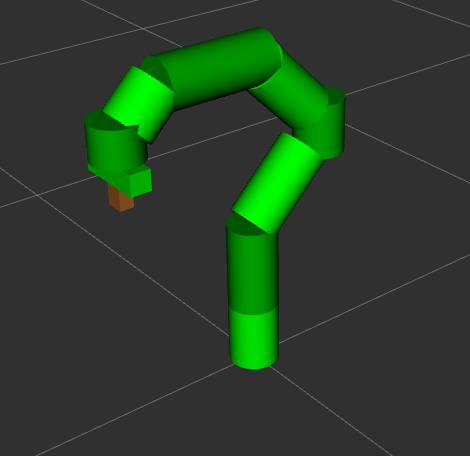

# Mantis Moveit2 Robotic Arm

This package implements a complete, fully autonomous pick and place pipeline using ROS2,
MoveIt2, and the MoveIt Task Constructor. Designed for automated multi-block manipulation, it coordinates grasp strategy generation, motion planning, and execution in a unified workflow. The system uses a fully custom robot URDF and provides several predefined scenarios to showcase block manipulation, accurate movement, and precise placement. It highlights the motion planning, grasping, and object placement capabilities.

---

### Project Overview

-   The system performs a sequence of automated manipulation tasks:
-   Spawn objects into the MoveIt planning scene
-   Compute valid grasp and place poses
-   Perform collision checking
-   Execute pick, lift, transport, place, retreat, and return motions
-   Supports multiple "scenarios" for demonstration

The Scenarios available for demonstration are:

-   _triangle_ - stacks 3 blocks in a pyramid shape, demonstrating multi-block manipulation
-   _stack_ - stacks 3 blocks vertically, showing precise control
-   _shapes_ - moves a box, cylinder, and sphere, handling different object types and grasp strategies

---

### Instructions

-   Follow [Getting Started](https://moveit.picknik.ai/main/doc/tutorials/getting_started/getting_started.html) to set up moveit2
-   Move and build colcon workspace

```bash
cd ~/ws_moveit/src
git clone https://github.com/galav12/mantis-moveit2-arm.git
```

-   Install missing packages

```bash
rosdep install --from-paths . --ignore-src --rosdistro $ROS_DISTRO
```

-   Build the workspace

```bash
cd ~/ws_moveit
colcon build
source install/setup.bash
```

-   Start by launching initial launch file

```bash
ros2 launch mantis-moveit2-arm moveit_project.launch.py
```

-   Launch pick and place movement with one of the following scenarios

```bash
ros2 launch mantis-moveit2-arm pick_and_place_project.launch.py scenario:=triangle
ros2 launch mantis-moveit2-arm pick_and_place_project.launch.py scenario:=stack
ros2 launch mantis-moveit2-arm pick_and_place_project.launch.py scenario:=shapes
```

---

### Results

Robot Arm URDF

